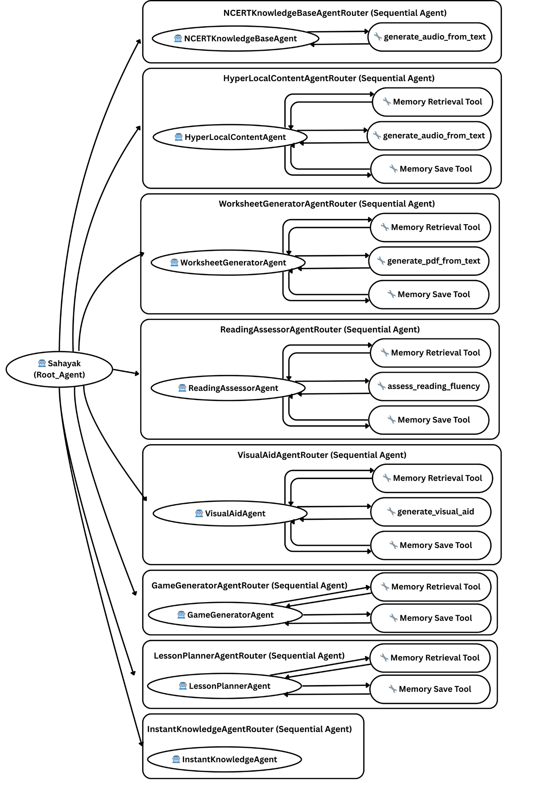
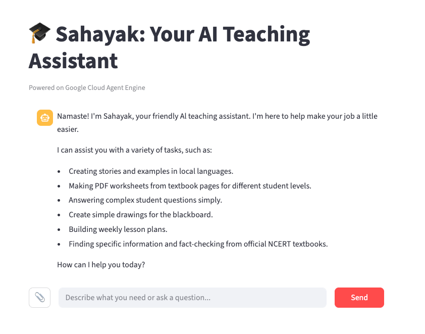
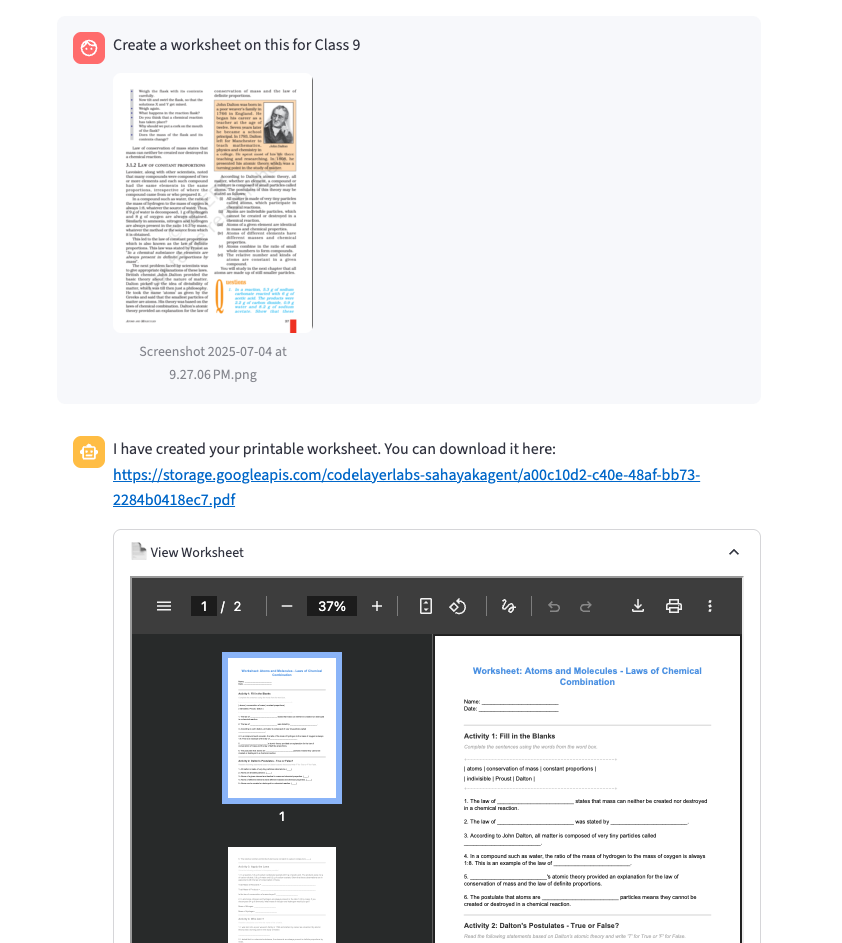
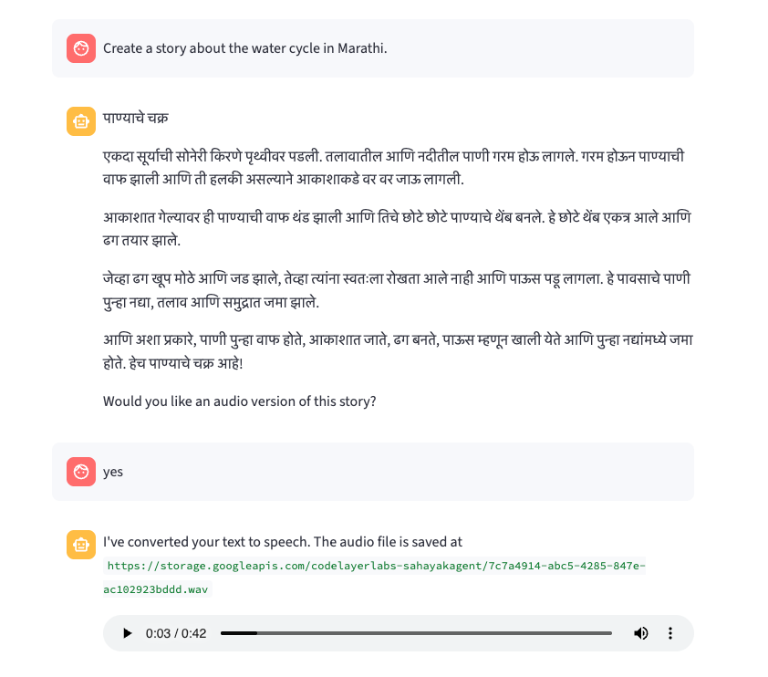
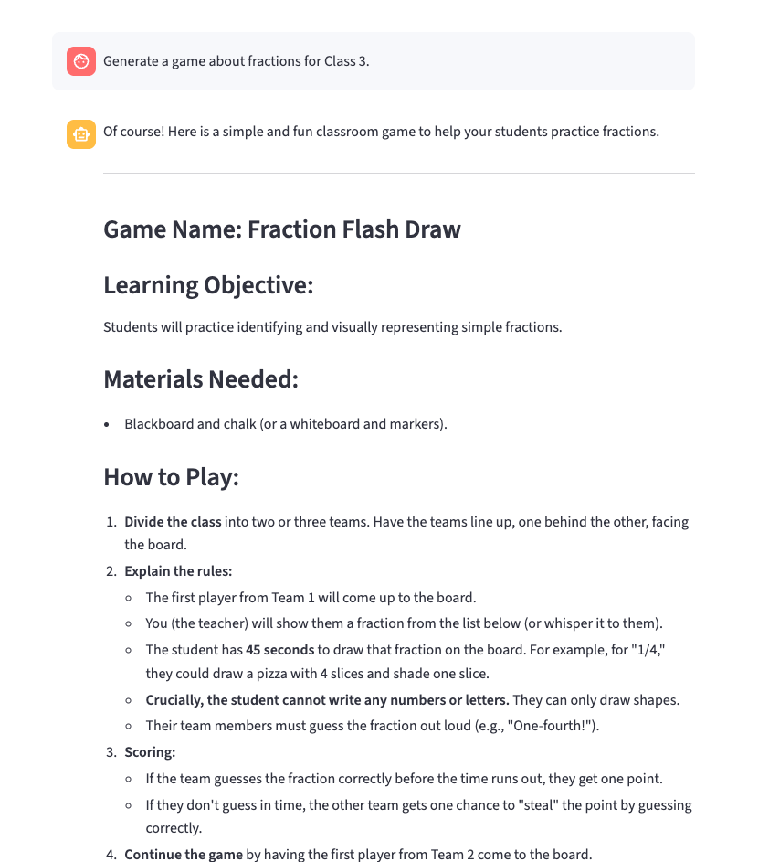

# Sahayak — Multimodal Agentic AI for Teachers

[](https://developers.google.com/)
[](https://cloud.google.com/vertex-ai)
[]

---

> **Sahayak** is an agentic, multimodal teaching assistant built with the **Google Agent Development Kit (ADK)** and deployed to Vertex AI **Agent Engine**. It empowers teachers in multi‑grade, low‑resource classrooms by routing requests to narrow, auditable specialist agents that produce lesson plans, worksheets, visuals, audio, assessments and textbook lookups.

---

## ✨ Project at a glance
- **Repo name:** `sahayak`
- **Primary language:** Python
- **Frameworks / SDKs:** Google ADK (Agent Development Kit), Vertex AI `agent_engines`, Google Cloud SDKs (Storage, Text‑to‑Speech, Speech‑to‑Text), ReportLab, Imagen/ImageGenerationModel
- **Deployed to:** Vertex AI Agent Engine
- **Primary goal:** Let teachers produce classroom‑ready materials with minimal input and low infra friction while keeping operations auditable and safe.

---

## 📁 Exact file structure (this repo)

```
.
├── app/
│   └── __main__.py        # deployment entry (agent_engines.create)
├── __init__.py
└── agent.py               # root agent, routers, specialist agents, FunctionTools
```

---

## 📌 Workflow (what actually runs — diagram)

Below is the authoritative workflow for Sahayak. The root agent accepts teacher input, decides which **SequentialAgent router** should handle it, and that router calls a single focused **specialist Agent**. Those specialists use deterministic Python `FunctionTool`s for any side effects (GCS uploads, TTS/ASR calls, image generation, PDF rendering) and memory access.



> **Note:** The image above is the live workflow used for documentation and architecture reviews. It maps one-to-one to `agent.py`.

---

## 🧭 Architecture — precise explanation (the *why* and *how*)
This section maps the diagram to the code and explains the engineering reasons behind the choices.

### Root + Routers (decision layer)
- **Root agent (`Sahayak`)** acts as the single, trusted entrypoint. Its job is *routing*: greet teacher, clarify intent minimally, and **delegate** to the correct SequentialAgent router. This keeps the root small and easy to audit.
- **Routers (SequentialAgent wrappers)** encapsulate routing logic per capability: `NCERTKnowledgeBaseAgentRouter`, `HyperLocalContentAgentRouter`, `WorksheetGeneratorAgentRouter`, `ReadingAssessorAgentRouter`, `VisualAidAgentRouter`, `GameGeneratorAgentRouter`, `LessonPlannerAgentRouter`, `InstantKnowledgeAgentRouter`.
- **Why routers?** They make decision logic testable and composable. If a new capability is added, you add a router not a massive monolith.

### Specialist Agents (execution layer)
Each router forwards the request to one narrow agent with strict instructions and an auditable contract. Examples:
- **NCERTKnowledgeBaseAgent** — queries Vertex search datastores (tools: `VertexAiSearchTool`) and optionally converts text to audio via `generate_audio_from_text`.
- **HyperLocalContentAgent** — generates stories/examples in local languages and uses memory tools for personalization (save/retrieve). It can call `generate_audio_from_text` for teacher-requested audio.
- **WorksheetGeneratorAgent** — formats content to a specific internal markdown convention, then **must** call `generate_pdf_from_text` to produce a printable PDF; the agent returns only the PDF link.
- **ReadingAssessorAgent** — performs transcription + metrics (via `assess_reading_fluency`) and synthesizes a coaching report.
- **VisualAidAgent** — calls `generate_visual_aid` (image model) and returns a public GCS URL.

**Why narrow agents?** Narrow scope reduces hallucination, simplifies prompt testing, and constrains the model’s allowed outputs to a predictable format (often just a single URL or a structured response).

### Tools (deterministic side effects)
All heavy I/O and side effects are handled by Python `FunctionTool` implementations. Examples in `agent.py`:
- `generate_visual_aid(prompt)` → produces an image via ImageGenerationModel, uploads to GCS, returns public URL.
- `generate_pdf_from_text(worksheet_text)` → renders a styled PDF with ReportLab, uploads to GCS, returns public URL.
- `assess_reading_fluency(original_text, student_audio_gcs_uri, language_code)` → transcribes with Cloud Speech, computes WPM/accuracy, returns structured JSON (agent converts to human report).
- `generate_audio_from_text(text, language_code, voice_name)` → uses long TTS to synthesize a LINEAR16 `.wav`, uploads to GCS, returns public URL.


## 📊 Screenshots









## Contact
**Sachin T.S** — https://sachints.dev  ·  https://www.linkedin.com/in/sachints-sk/

---

